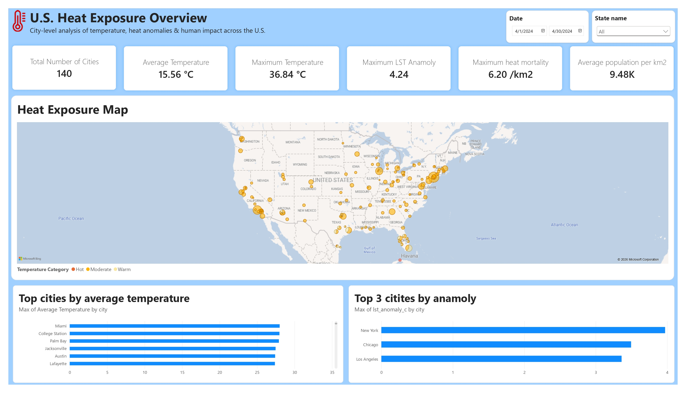
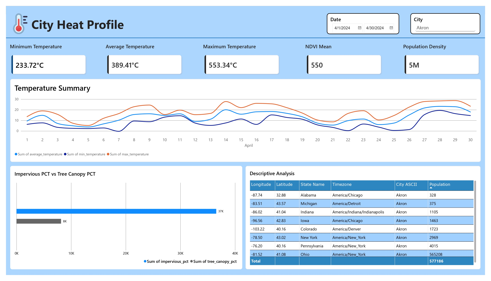

# 🌡️ Heat Impact 
## Quantifying the Relationship Between Urban Temperature, Community Vulnerability, and Retail Activity Across U.S. Cities

## Dashboard Page 1



## Dashboard Page 2



> **Data Analysis & Correlation Track**

Heat Impact is a data analytics project that investigates how urban temperature relates to **people, communities, and business activity** across U.S. cities.

The project uses **FortyGuard's temperature and heatmap intelligence as the core data source**, combining it with socioeconomic, demographic, and retail/business datasets to identify measurable relationships between heat exposure and real-world outcomes.

Rather than simply asking **"Where is it hot?"**, Heat Impact asks:

> **"Who is exposed to higher temperatures, and how does urban heat relate to economic activity?"**

---

# 🎯 Problem Statement

Extreme urban temperatures can affect more than the physical environment.

Heat can influence:

- Community vulnerability
- Energy demand
- Human activity
- Retail activity
- Business operations
- Infrastructure
- Urban planning

However, temperature alone does not explain the complete impact.

Heat Impact combines temperature observations with external datasets to investigate whether measurable relationships exist between **urban heat, socioeconomic conditions, and retail activity**.

---

# 🔎 Core Research Questions

The project focuses on three main questions.

### 1. Where is urban heat concentrated?

Using FortyGuard's spatial temperature data:

- Which cities experience higher temperatures?
- How much does temperature vary within a city?
- Which areas have the highest and lowest temperatures?
- How does temperature change across different dates?

### 2. Who is exposed?

We investigate relationships between temperature and socioeconomic characteristics such as:

- Population
- Population density
- Income
- Poverty
- Housing characteristics
- Other available vulnerability indicators

### 3. How does heat relate to business activity?

We investigate whether temperature is associated with changes in:

- Retail activity
- Sales
- Foot traffic
- Other available business indicators

The goal is not to claim causation, but to identify statistically meaningful **associations and patterns**.

---

### Heat Intelligence API

Completed Heat Intelligence activities provide endpoint-specific intelligence reports through a temporary PDF download link.

The project retrieves the report, extracts relevant analytical information, and incorporates it into the broader analytics workflow where applicable.

---
# 📊 Dashboard

The final analytical results will be presented through an interactive dashboard designed to answer two key questions:

1. **Where is heat risk highest across the U.S.?**
2. **Why is a particular city experiencing higher heat risk?**

---

## Dashboard 1 — 🇺🇸 U.S. Heat Risk Overview

### Purpose

Provide an immediate overview of **heat risk across U.S. cities** and identify locations with the highest exposure.

### 🎯 Key Performance Indicators

| KPI                         | Variable / Calculation                   |
| --------------------------- | ---------------------------------------- |
| 🏙️ Cities Analyzed         | `COUNT(city)`                            |
| 🌡️ Average Temperature     | `AVG(temperature_celsius)`               |
| 🔥 Hottest City             | `MAX(temperature_celsius)`               |
| ⚠️ Highest Heat Index       | `MAX(heat_index)`                        |
| 🏙️ Highest UHI             | `MAX(uhi_intensity)`                     |
| 📈 Avg. Temperature Anomaly | `AVG(temperature_deviation_from_normal)` |

> **Design principle:** Avoid overcrowding the dashboard with KPIs. These six provide a concise summary of the overall heat-risk situation.

### 🏆 City Heat-Risk Ranking

| Rank | City      | Temp | Heat Index |   UHI | Anomaly | 2050 Warming |
| ---: | --------- | ---: | ---------: | ----: | ------: | -----------: |

> Is extreme heat concentrated in a few cities, or is it widespread?

### 🔎 Dashboard Filters

Place the primary filters at the top of the dashboard:

* `City`
* `Date`

---

# Dashboard Page 2 — 🏙️ City Heat Intelligence

### Purpose

Provide an interactive **city-level drill-down** for detailed heat analysis.

This page is not another U.S. overview. Instead, it allows users to investigate **why a specific city is experiencing higher heat risk**.

### 🔎 User Selection

Users can filter by:

* `City`
* `Date`


Once selected, the entire dashboard updates for that city and date.

---

## 🌡️ Section — Temperature

### KPI Cards

| KPI                     | Variable                            |
| ----------------------- | ----------------------------------- |
| 🌡️ Average Temperature | `average_temperature`               |
| 🔻 Minimum Temperature  | `min_temperature`                   |
| 🔥 Maximum Temperature  | `max_temperature`                   |
| 📈 Temperature Anomaly  | `temperature_deviation_from_normal` |

### Temperature Comparison

Show the relationship between:

* Current / Average Temperature
* Historical Typical Temperature
* Temperature Anomaly
* Minimum Temperature
* Maximum Temperature
* Record Temperature

---

## 🎯 Dashboard Story

The two-page dashboard follows a simple analytical flow:

```text
U.S. Overview
      ↓
Identify High-Risk Cities
      ↓
Select City
      ↓
Analyze Temperature
      ↓
Measure Human Heat Stress
      ↓
Analyze Urban Heat Island
      ↓
Explore Historical Trends
      ↓
Understand Future Risk
```

---

# 🧰 Technologies

### Data Collection

* Python
* REST APIs
* FortyGuard API
* Geocoding API

### Data Processing

* Python
* Pandas
* NumPy
* GeoJSON
* PDF extraction

### Statistical Analysis

* SciPy
* Statistical correlation
* Regression analysis

### Visualization

* Power BI
* Matplotlib
* Seaborn

### Development

* Git
* GitHub
* `.env` environment configuration

---

# 💡 Expected Insights

The project aims to answer questions such as:

### Urban Heat

> Which U.S. cities and areas experience the highest temperatures?

### Heat Equity

> Are hotter areas associated with greater socioeconomic vulnerability?

### Business Impact

> Is temperature associated with changes in retail activity?

### Spatial Variation

> How much can temperature vary within the same city?

### Cross-City Comparison

> Which characteristics are most strongly associated with urban temperature?

---

# 🌎 Potential Impact

The findings could support:

### Urban Planning

Identify areas that may require additional heat mitigation strategies.

### Public Policy

Understand whether vulnerable communities are disproportionately exposed to heat.

### Retail & Business Planning

Identify potential relationships between extreme temperatures and business activity.

### Climate Resilience

Provide data-driven evidence for prioritizing urban heat interventions.


[Dashboard Screenshot]
